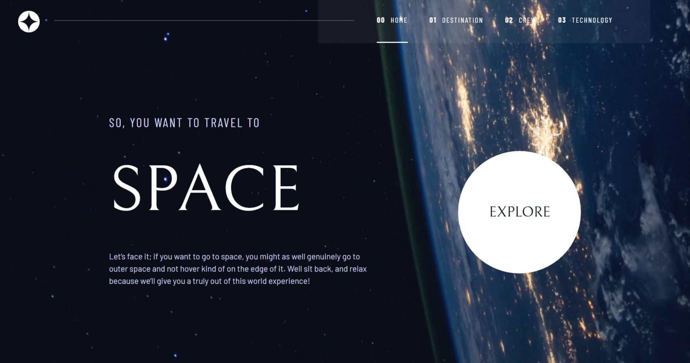
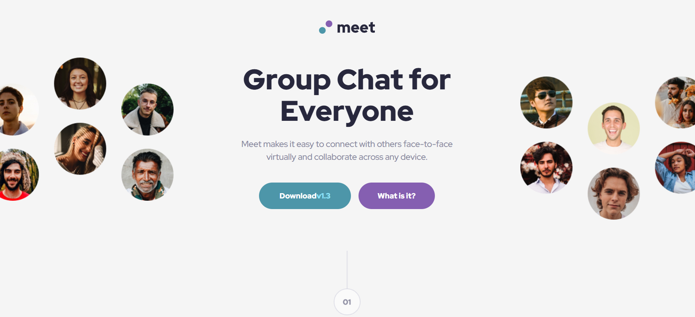

---

<h2 style="padding-top: 40px; margin: 0px;">🙋About me</h2>

平時喜歡打遊戲、健身、聽音樂、彈彈吉他 
目前正專注自學前端中，並熱衷於透過AI工具來優化開發效率 
期望能成為不受限於前端，能開發出有人性、有趣、有價值的產品 
如果您對我的作品感興趣，歡迎與我聯繫~

<h2 style="padding-top: 60px; margin: 0px;">📚Projects</h2>

<h4>⚒️Full Stack (全端)</h4>

🐱MeowChat</a> <a href="https://meow-chat-vercel.vercel.app" target="_blank" style="font-size: 14px; margin-left: 12px;">Demo</a>

透過結合Socket.io實現實時聊天功能，支援全服、群組、私聊 
並且支援貼圖訊息、回復訊息、撤回訊息等功能

<a href="https://github.com/Benson0721/MeowChat_vercel" target="_blank" style="font-size: 20px; font-weight: bold; margin-right: 20px;">📸Photographer_Portfolio</a> <a href="https://photographer-portfolio-frontend-vercel.vercel.app" target="_blank" style="font-size: 14px; margin-left: 12px;">Demo</a>

攝影師作品集管理頁面，結合Cloudinary管理/壓縮圖片畫質 
並能夠在前台管理攝影集圖片，建立不同主體的作品集 並能傳送電子郵件聯絡作者

<a href="https://github.com/Benson0721/Dictionary_App_frontend_vercel" target="_blank" style="font-size: 20px; font-weight: bold; margin-right: 20px;">📙Dictionary_App</a> <a href="https://dictionary-app-frontend-vercel.vercel.app" target="_blank" style="font-size: 14px; margin-left: 12px;">Demo</a>

串接外部API實現字典查詢功能，包含不同的詞性、字義、發音、例句 
並支援單字收藏功能，讓用戶可對收藏的單字進行管理

<h4 style="padding-top: 40px; margin: 0px;">👁️Frontend (純前端)</h4>

<a href="https://github.com/Benson0721/Space-Website?tab=readme-ov-file" target="_blank" style="font-size: 20px; font-weight: bold; margin-right: 10px;">🌌Space_Website</a><a href="https://benson0721.github.io/Space-Website/" target="_blank" style="font-size: 14px; margin-left: 12px;">Demo</a>

<a href="https://github.com/Benson0721/Tailwind-meet-landing" target="_blank" style="font-size: 20px; font-weight: bold; margin-right: 10px;">📱Meet-landing</a><a href="https://benson0721.github.io/Tailwind-meet-landing/" target="_blank" style="font-size: 14px; margin-left: 12px;">Demo</a>

<h2 style="padding-top: 40px; margin: 0px;">🔨Toolbox</h2>

<h2 style="padding-top: 60px; margin: 0px;">👨‍💻Dashboard</h2>

